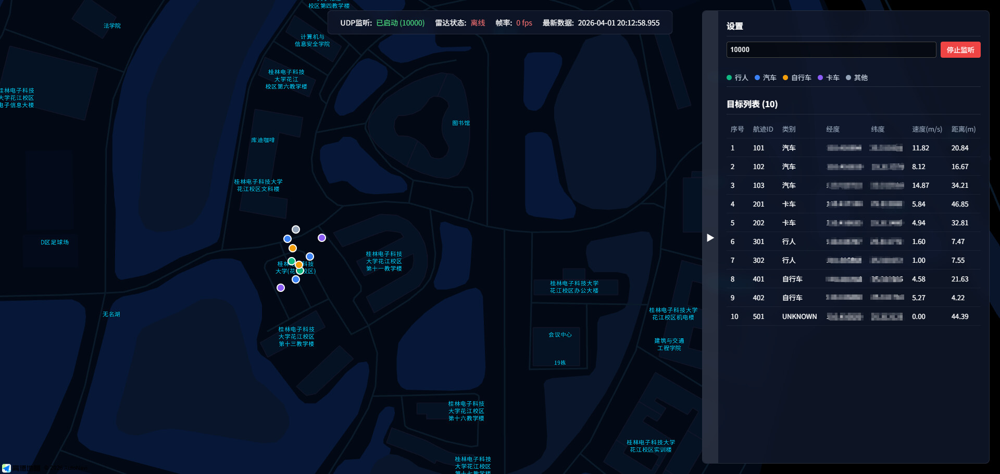

# 雷达上位机显控平台 (Radar Monitor)

## 📖 项目简介
本项目是一个雷达上位机显控平台，采用前后端分离的架构，专门用于实时接收、处理并展示雷达目标数据。系统通过 UDP 协议动态接收雷达推送的数据，并在后端进行解析与状态计算后，通过 WebSocket 实时推送到前端。前端基于高德地图和 Vue 3 提供沉浸式的全屏监控体验、实时点位刷新以及目标航迹表格。

## ✨ 功能特性
- **动态 UDP 监听**：支持通过页面随时配置并启动/停止指定端口的 UDP 监听。
- **实时数据流处理**：高性能解析雷达目标 JSON 数据包，自动计算帧率（FPS）及系统在线状态。
- **WebSocket 实时推送**：前后端建立全双工通信，保证目标航迹和系统状态的低延迟下发。
- **沉浸式地图显控**：基于高德地图，绘制雷达本车位置与各类型目标点位，支持无闪烁的平滑刷新。
- **实时目标面板**：提供目标列表表格、状态筛选、速度/距离排序及点击地图联动定位功能。
- **高可用设计**：后端具备完善的异常捕获与容错处理（应对网络丢包、非法 JSON 等情况），保障系统稳定运行。

## 🛠 技术栈

### 前端 (Frontend)
- **核心框架**：Vue 3 (Composition API)
- **构建工具**：Vite
- **地图服务**：高德地图 API (`@amap/amap-jsapi-loader`)
- **UI 布局**：全屏地图 + 半透明悬浮响应式面板

### 后端 (Backend)
- **开发语言**：Java 17
- **核心框架**：Spring Boot 3.2.4
- **通信协议**：UDP (`java.net.DatagramSocket`) + WebSocket
- **数据处理**：Jackson (JSON 序列化/反序列化)
- **工具库**：Lombok

## 🚀 快速开始

### 环境准备
- Java 17 或以上版本
- Maven 3.6+
- Node.js 18+
- npm 或 yarn / pnpm

### 1. 运行后端服务
进入 `backend` 目录，编译并启动 Spring Boot 应用。后端默认运行在 `8080` 端口。

```bash
cd backend
mvn clean install
mvn spring-boot:run
```
*(或者通过 IDE 导入为 Maven 项目并直接运行 `RadarMonitorApplication` 主类)*

### 2. 运行前端服务
进入 `frontend` 目录，安装依赖并启动 Vite 开发服务器。前端默认运行在 `5173` 端口。

```bash
cd frontend
npm install
npm run dev
```

### 3. 使用说明
1. 确保前后端服务均已启动。
2. 在浏览器中打开前端访问地址（通常为 `http://localhost:5173`）。
3. 在页面右侧悬浮面板的顶部，输入你要监听的 UDP 端口（例如 `8888`）。
4. 点击 **启动监听** 按钮。
5. 后端开始接收该端口的雷达 UDP 报文，前端地图和表格将实时更新目标航迹。

**【注】还需要修改frontend\src\components\RadarMap.vue的center: [xxx, xxx], // 默认地点，由于此处涉及到国家地理位置，故此处不显示**

## 📁 目录结构说明
```text
/workspace
├── backend/          # Spring Boot 后端服务
│   ├── src/main/java/com/radar/monitor/
│   │   ├── controller/   # HTTP 控制接口（启动/停止监听等）
│   │   ├── udp/          # UDP 数据监听与接收
│   │   ├── websocket/    # WebSocket 实时数据推送配置
│   │   ├── service/      # 业务逻辑（数据解析与状态计算）
│   │   └── model/        # 数据模型实体类
│   └── pom.xml           # 后端 Maven 依赖配置
├── frontend/         # Vue 3 前端应用
│   ├── src/              # 前端源码
│   ├── package.json      # 前端依赖配置
│   └── vite.config.js    # Vite 配置文件
└── docs/             # 项目文档与设计说明
```

## 项目展示


